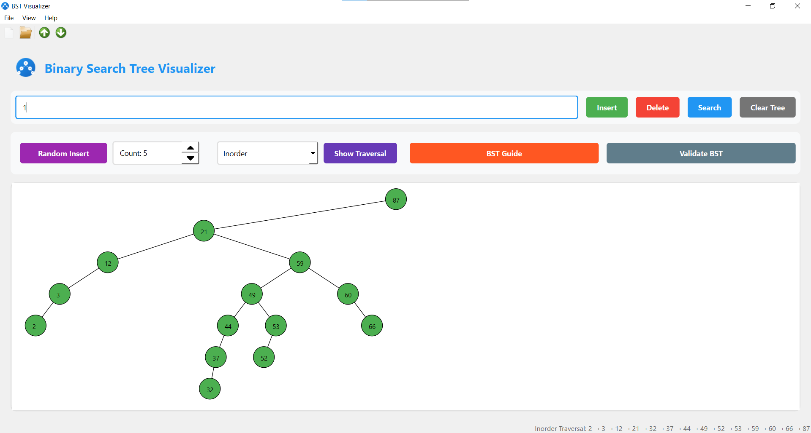
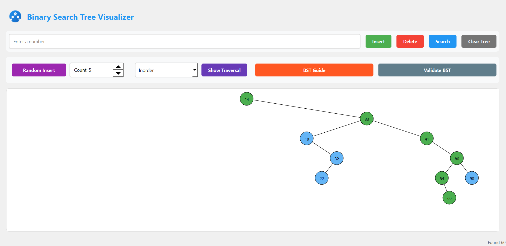

# Binary Search Tree Visualization

An educational tool for visualizing Binary Search Tree operations, built with Qt 6 and modern C++.


## Screenshots

<div align="center">
  
  
</div>


## Features

- Interactive BST visualization
- Core BST operations:
  - Insert nodes
  - Delete nodes
  - Search nodes
  - Clear tree
  - Random node generation
- Tree traversals:
  - Inorder
  - Preorder
  - Postorder
- Educational components:
  - BST property validation
  - Operation explanations
  - Visual feedback
- Professional UI with consistent light theme

## Prerequisites

- Windows 7 or later
- 4GB RAM recommended
- 100MB free disk space
- 1024x768 minimum screen resolution

## Installation

### Option 1: Using the Installer
1. Download the latest release from the [Releases](../../releases) page
2. Run `BST_Visualizer_v1.0_Setup.exe`
3. Follow the installation wizard

### Option 2: Building from Source

#### Requirements
- Qt 6.8.0 or later
- CMake 3.16 or later
- MinGW 13.1.0 or later
- C++17 compatible compiler

#### Build Steps
1. Clone the repository:
   ```bash
   git clone https://github.com/Razee4315/BinarySearchTreeVisualization.git
   cd BinarySearchTreeVisualization
   ```

2. Create build directory:
   ```bash
   mkdir build
   cd build
   ```

3. Configure and build:
   ```bash
   cmake ..
   cmake --build .
   ```

## Usage

1. Launch the application
2. Use the input field to enter numbers
3. Click operation buttons to perform BST operations
4. Observe the visual representation of the tree
5. Use the BST Guide for learning concepts
6. Validate tree properties as needed

## Contributing

1. Fork the repository
2. Create your feature branch (`git checkout -b feature/AmazingFeature`)
3. Commit your changes (`git commit -m 'Add some AmazingFeature'`)
4. Push to the branch (`git push origin feature/AmazingFeature`)
5. Open a Pull Request

## License

This project is licensed under the MIT License - see the [LICENSE](LICENSE) file for details.

## Acknowledgments

- Qt Framework team
- C++ community
- All contributors and testers

## Author

Saqlain - [@Razee4315](https://github.com/Razee4315)

## Support

For support, email [your-email] or create an issue in the repository.
